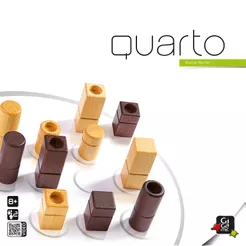

# Quarto Team 3

Quarto is a strategic two-player board game! This is a virtual 2D implementation using Python and Tkinter with slightly modified characteristics.

This is currently version 1!

## Characteristics
- Color: green / purple
- Shape: square / circle
- Size: big / small
- Fill: solid / hollow

## Contributors
- Madeline Stokes
- Cruse Aea
- Andrew Shiroma
